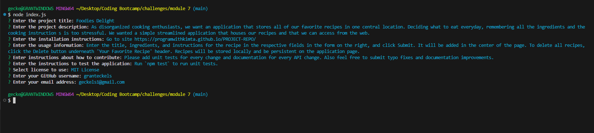

# Professional README Generator

## Description

This application generates a professional README.md that includes a project title, description, installation instructions, usage instructions, which license it's using, notes on how to contribute, how to test the application, and how to contact the project owner with questions.

## Screenshot

## Link to Walkthrough Video

https://drive.google.com/file/d/16xIvFZFijAio2Mn8b8LQR93_MiZ6taFB/view?usp=sharing